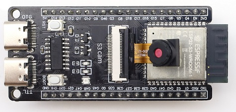
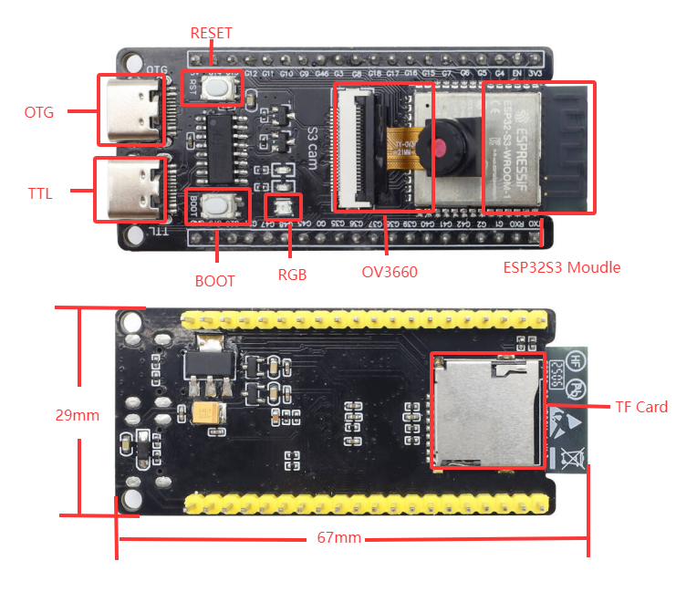
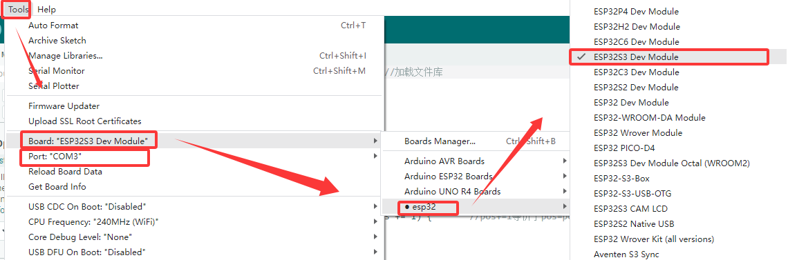
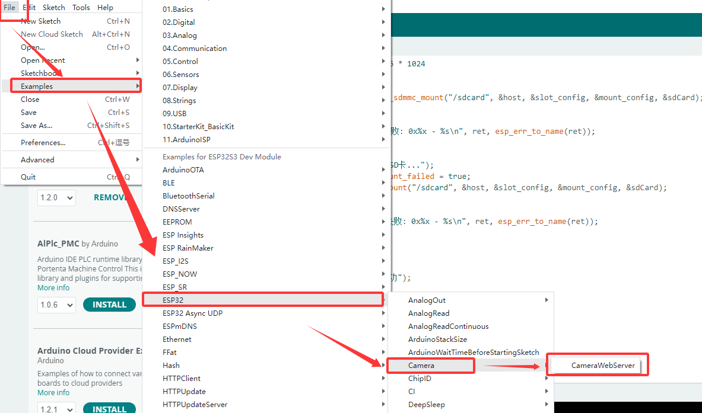
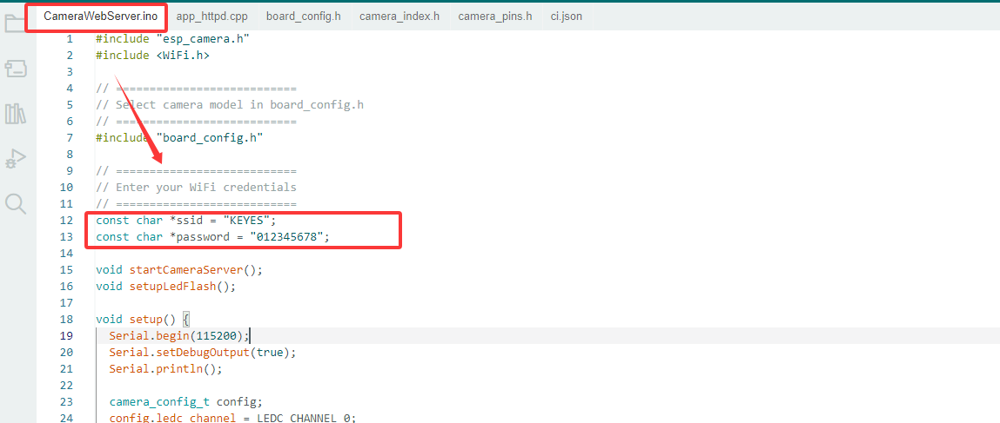
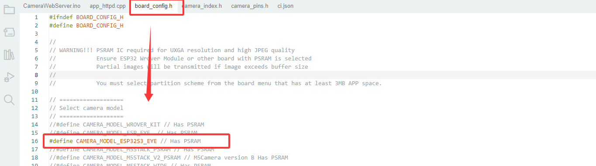
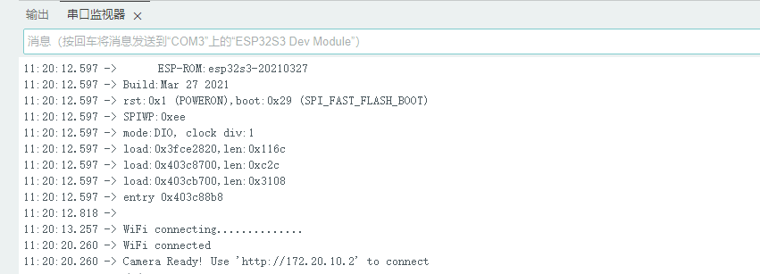
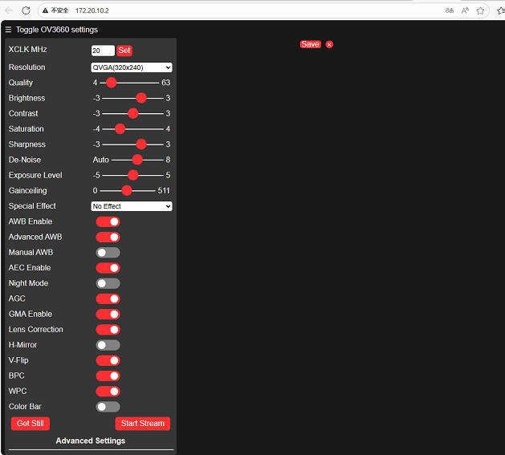
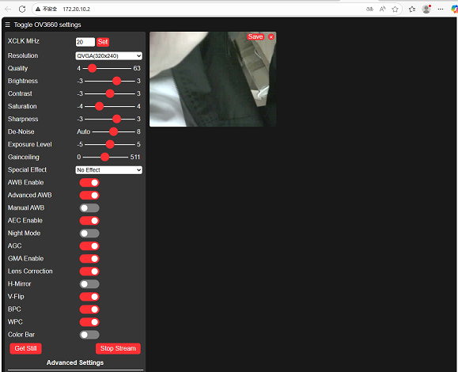
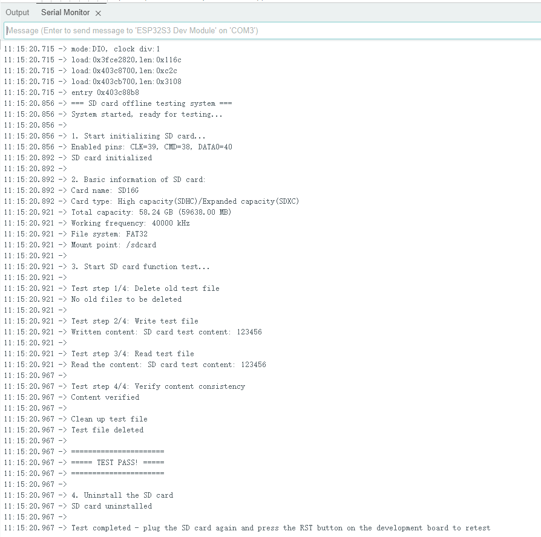

# MB0184 S3 cam



## 1. Introduction

The S3 mini development board is based on the Espressif ESP32 S3 WROOM-1-N16R8 module. It comes with a dual-core Xtensa LX7 MCU whose main frequency is up to 240MHz, and it integrates storage(16MB FLASH and 8MB SRAM), 2.4GHz Wi-Fi and low-power Bluetooth(Bluetooth® LE). It is also rich on interfaces, including Type-C to serial port, Type-C to OTG, RGB LED, and GPIO pin headers with a spacing of 25.5mm, which is convenient to quickly develop and experiment. Therefore, it is widely applied to smart home, industrial automation, healthcare, consumer electronics, smart farm, etc.

## 2. Parameters

- Operating voltage: DC3.3V
- Input voltage: DC3.3~DC5V 
- Operating current: 120mA(average)
- ESP32 module: ESP32-S3-WROOM-1
- FLASH: 16MB
- Clock frequency: 240MHZ
- Camera type: OV3660
- SD card: SD_MMC one-line mode
- USB to Serial Port: Type C interface, CH340C USB to serial port chip (programs can be downloaded through this interface)
- USB to OTG: Type-C interface, used for debugging or mounting external storage devices
- Dimensions: 67*29mm

## 3. Pin-out



For specific pin functions, please refer to the [User Manual](https://www.espressif.com.cn/sites/default/files/documentation/esp32-s3_datasheet_cn.pdf).
Schematic table for connecting board pins to peripheral devices

| Development board | Camera | SD card |
| :-- | :-- | :-- |
| IO4 | SIOD |  |
| IO5 | SIOC |  |
| IO6 | VYSNC |  |
| IO7 | HREF | |
| IO15 | XCLK |  |
| IO16 | Y9 | |
| IO17 | Y8 |  |
| IO18 | Y7 |  |
| IO12 | Y6 | |
| IO10 | Y5 |  |
| IO8 | Y4 |  |
| IO9 | Y3 |  |
| IO11 | Y2 |  |
| IO13 | PCLK |  |
| IO38 |  | CMD |
| IO39 |  | CLK |
| IO40 |  | DATA |
## 4. Arduino

For the installation of Arduino IDE, please refer to: [Arduino IDE](https://docs.keyestudio.com/projects/KT0303/en/latest/docs/Arduino_Tutorial.html#arduino-ide)
Please read Chapter 4 of the above link carefully.

### Downlaod

For how to install ESP32 chip package, there are instructions in the above reference, too.
Open Arduino IDE and click Tool->Board->esp32->ESP32S3 DEV Moudle; Select the new port after connecting the board by USB cable. If there are no any new port, please check whether you [install CH340 driver](https://docs.keyestudio.com/projects/KT0303/en/latest/docs/Arduino_Tutorial.html#arduino-ide) or try another USB cable.


### OV3660 Example

Click “File->Example->ESP32->Camera->CameraWebServer”

In **CameraWebServer.ino**, Modify the WiFi password and account name that the development board needs to connect to. "*ssid" is name and "*password" is WiFi passwords.
**Note: When observing the experiment result on the camera later, the computer also needs to be connected to this WiFi.**(The development board and the computer need to be on the same local area network)

In **board.config.h**, modify board model to “CAMERA_MODEL_ESP32S3_EYE”.

Click  to download the program. And then the serial monitor shows:

Enter the printed link "http://172.20.10.2" in the browser (please refer to the printed version for the specific link).

        
After entering, there will be no screen at first. We need to click “Start Stream” to enable the screen:


### SD Card Sample

First of all, connect the development board to the computer properly and select the corresponding development board and port.

Then copy the following code and burn it directly onto the development board.

```
#include "driver/sdmmc_host.h"
#include "driver/sdmmc_defs.h"
#include "esp_vfs_fat.h"
#include "sdmmc_cmd.h"
#include <stdio.h>
#include <string.h>
#include <unistd.h>

// SDIO pin definition - SDIO pins of ESP32-S3
#define SD_CLK_PIN GPIO_NUM_39  // SD card clock
#define SD_CMD_PIN GPIO_NUM_38  // SD card command
#define SD_D0_PIN  GPIO_NUM_40  // SD card data cable 0

// Global variable
bool sdCardAvailable = false;
sdmmc_card_t* sdCard = nullptr; 

// Function declaration
bool initSDCard();
bool testSDCard();
void printSDCardInfo();
void printTestResult(bool result);
void unmountSDCard();
void runTestCycle();

void setup() {
  // Initialize the serial port
  Serial.begin(115200);
  
  // Wait for the serial port to be ready
  while (!Serial) {
    usleep(100000); // Wait for 0.1 seconds
  }
  
  Serial.println("=== SD card offline testing system ===");
  Serial.println("System started, ready for testing...\n");
  
  // Run the initial test
  runTestCycle();
  
  // Prompt the user to retest
  Serial.println("\nTest completed - plug the SD card again and press the RST button on the development board to retest");
}

void loop() {
  // The main loop remains idle and does not perform any operations
  delay(1000);
}

// Complete testing process
void runTestCycle() {
  // Initialize the SD card
  Serial.println("1. Start initializing SD card...");
  sdCardAvailable = initSDCard();
  
  if (sdCardAvailable) {
    // Print the basic information of the SD card
    Serial.println("\n2. Basic information of SD card:");
    printSDCardInfo();
    
    // Perform the SD card test
    Serial.println("\n3. Start SD card function test...");
    bool testResult = testSDCard();
    
    // Print the test results
    printTestResult(testResult);
    
    // Uninstall the SD card (release resources)
    Serial.println("\n4. Uninstall the SD card");
    unmountSDCard();
  } else {
    Serial.println("\nInitialization failed, testing cannot be conducted");
  }
}

// Initialize the SD card - SDMMC mode
bool initSDCard() {
  Serial.printf("Enabled pins: CLK=%d, CMD=%d, DATA0=%d\n", 
                SD_CLK_PIN, SD_CMD_PIN, SD_D0_PIN);

  // Configure the SDMMC host
  sdmmc_host_t host = SDMMC_HOST_DEFAULT();
  host.max_freq_khz = SDMMC_FREQ_HIGHSPEED;
  
  // Configure the SDMMC slot
  sdmmc_slot_config_t slot_config = SDMMC_SLOT_CONFIG_DEFAULT();
  slot_config.clk = (gpio_num_t)SD_CLK_PIN;
  slot_config.cmd = (gpio_num_t)SD_CMD_PIN;
  slot_config.d0 = (gpio_num_t)SD_D0_PIN;
  slot_config.width = 1;  // 1-bit mode
  
  // Mounting failed
  esp_vfs_fat_sdmmc_mount_config_t mount_config = {
    .format_if_mount_failed = false,
    .max_files = 5,
    .allocation_unit_size = 16 * 1024
  };
  
  esp_err_t ret = esp_vfs_fat_sdmmc_mount("/sdcard", &host, &slot_config, &mount_config, &sdCard);
  
  if (ret != ESP_OK) {
    Serial.printf("SDMMC mounting failed: 0x%x - %s\n", ret, esp_err_to_name(ret));
    
    // Try formatting
    Serial.println("Try formatting SD card...");
    mount_config.format_if_mount_failed = true;
    ret = esp_vfs_fat_sdmmc_mount("/sdcard", &host, &slot_config, &mount_config, &sdCard);
    
    if (ret != ESP_OK) {
      Serial.printf("Formatting failed.: 0x%x - %s\n", ret, esp_err_to_name(ret));
      return false;
    }
  }
  
  Serial.println("SD card initialized");
  return true;
}

  // SD card test function
bool testSDCard() {
  if (!sdCardAvailable) return false;
  
  String testPath = "/sdcard/test.txt";
  bool testPassed = true;
  
  // 1. Delete any possible old test files
  Serial.println("\nTest step 1/4: Delete old test file");
  if (remove(testPath.c_str()) != 0) {
    if (errno != ENOENT) {  // ENOENT indicates that the file does not exist, which is a normal situation
      Serial.printf("Deletion failed: %s\n", strerror(errno));
      testPassed = false;
    } else {
      Serial.println("No old files to be deleted");
    }
  } else {
    Serial.println("Old file deleted");
  }
  
  // 2. Write the test file
  Serial.println("\nTest step 2/4: Write test file");
  FILE* file = fopen(testPath.c_str(), "w");
  if (!file) {
    Serial.println("Write failed: Unable to create file");
    return false;
  }
  
  const char* testContent = "SD card test content: 123456";
  fprintf(file, "%s", testContent);
  fclose(file);
  Serial.printf("Written content: %s\n", testContent);
  
  // 3. Read the test file
  Serial.println("\nTest step 3/4: Read test file");
  file = fopen(testPath.c_str(), "r");
  if (!file) {
    Serial.println("Read failed: Unable to open file");
    return false;
  }
  
  char content[100] = {0};
  fread(content, 1, sizeof(content)-1, file);
  fclose(file);
  
  // Remove possible line breaks
  String contentStr = String(content);
  contentStr.trim();
  Serial.printf("Read the content: %s\n", contentStr.c_str());
  
  // 4. Verify content
  Serial.println("\nTest step 4/4: Verify content consistency");
  if (contentStr != testContent) {
    Serial.println("Content verification failed: Expectations do not match reality");
    testPassed = false;
  } else {
    Serial.println("Content verified");
  }
  
  // Clean up the test file
  Serial.println("\nClean up test file");
  if (remove(testPath.c_str()) != 0) {
    Serial.printf("Test file deletion failed: %s\n", strerror(errno));
    // Deletion failure is not regarded as a test failure
  } else {
    Serial.println("Test file deleted");
  }
  
  return testPassed;
}

// Print the SD card information
void printSDCardInfo() {
  if (!sdCardAvailable) return;
  
  // Card name
  Serial.printf("Card name: %s\n", sdCard->cid.name);
  
  // Card type
  Serial.print("Card type: ");
  if (sdCard->ocr & 0x40000000) {
    Serial.println("High capacity(SDHC)/Expanded capacity(SDXC)");
  } else {
    Serial.println("Standard capacity(SDSC)");
  }
  
  // Capacity information
  uint64_t cardSize = (uint64_t)sdCard->csd.capacity * sdCard->csd.sector_size;
  Serial.printf("Total capacity: %.2f GB (%.2f MB)\n", 
                (float)cardSize / (1024 * 1024 * 1024),
                (float)cardSize / (1024 * 1024));
  
  // Working frequency
  Serial.printf("Working frequency: %d kHz\n", sdCard->max_freq_khz);
  
  // File system
  Serial.println("File system: FAT32");
  Serial.println("Mount point: /sdcard");
}

// Print the test results
void printTestResult(bool result) {
  Serial.println("\n======================");
  if (result) {
    Serial.println("===== TEST PASS! =====");
  } else {
    Serial.println("===== TEST FAILED! =====");
  }
  Serial.println("======================");
}

// Uninstall the SD card
void unmountSDCard() {
  if (sdCardAvailable) {
    esp_vfs_fat_sdmmc_unmount();
    sdCardAvailable = false;
    Serial.println("SD card uninstalled");
  }
}
```
After burning, the serial port will print the following test information.

If the above information is not shown, please replace the SD card with a capacity of less than 64GB or format the SD card to FTA32.

## 5. Precautions

1.Cannot burn the program to the development board?

A: Please replace the data cable or reinstall the CH340 driver.

2.Do not directly connect high-power motors through the IO port.
